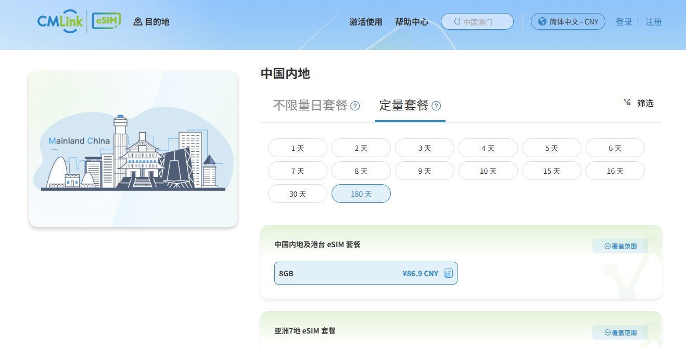

# 中国内地可用 eSIM 购买指南：激活规则、国际网络、热点共享、香港号码与开卡路径

如果你最近在搜这些词：

- 中国 eSIM
- eSIM 中国
- 中国内地可用 eSIM
- 香港 eSIM 中国能用吗
- 中国 eSIM 热点共享
- 香港号码 eSIM

那你真正要解决的问题，通常不是“有没有卡”，而是下面这几个更实际的判断：

1. 到了中国内地以后，能不能顺利用。
2. 要不要提前去境外预激活。
3. 能不能开热点给电脑和平板。
4. 有没有香港线路、香港号码、短信能力。
5. 价格是不是只看总价，还是要看每 GB 成本。

这也是为什么越来越多人开始把 eSIM 当成一种更轻的国际网络准备方案。很多人会把它理解成传统 VPN 之外的另一种移动数据路径，但真正长期好用的关键，还是可用性、激活规则、交付速度和后续续费能力。

访问入口：

- [esimka.top](https://esimka.top)
- GitHub Pages 独立页：[中国内地可用 eSIM 购买指南](https://rul2tlf-maker.github.io/china-esim-mainland-activation-guide/)

## 为什么现在更要认真看中国 eSIM

最近一两年，很多用户搜索“中国 eSIM”的时候，关注点已经从“有没有套餐”转成了“能不能少折腾地用起来”。

结合本地整理的公开资料，围绕部分中国相关 eSIM 产品的激活规则，市场上已经出现明显变化。一个典型例子是围绕 CMLink Global 的公开转引内容，重点提到：

- 相关规则变化时间点集中在 **2026 年 6 月 17 日** 前后。
- 部分含中国内地流量的产品，不再适合在中国内地直接完成首次启用。
- 购买前需要格外看清是否要求 **境外预插卡**、是否存在 **72 小时窗口**、是否还有额外启用限制。

这件事带来的启发很直接：

> 买中国内地可用 eSIM，不能只看便宜不便宜，还要看激活门槛和实际落地步骤。

## 购买中国内地可用 eSIM，建议按这 5 步判断

### 1. 先看激活规则

这是最容易被忽略，但最影响体验的一步。

你要先确认：

- 是否能在中国内地直接启用
- 是否要求出发前境外插卡
- 是否需要特定时间窗口内完成激活
- 是否需要额外实名或额外验证流程

如果激活门槛太重，套餐再便宜，最后也可能变成高折腾成本。

### 2. 再看每 GB 成本

很多套餐会把总价写得很显眼，但如果你本来就要长期备用、频繁热点共享、或者跨境办公，每 GB 成本通常比总价更值得看。

当前内部销售与市场观察口径里，常见报价带宽大致如下：

| 品类 | 常见报价带宽 |
| --- | --- |
| 中国移动香港实体卡 | 约 5 到 6 CNY/G |
| 中国移动香港 eSIM | 约 6 到 8 CNY/G |
| 中国联通香港实体卡 | 约 5 到 6 CNY/G |
| 中国联通香港 eSIM | 约 4 到 5 CNY/G |
| 其他中国可用 eSIM | 约 4 到 10 CNY/G |

而 `esimka.top` 的部分漫游流量可低至 **3.5 CNY/G**，这也是它对长期使用者更有吸引力的地方之一。

### 3. 看是不是香港线路，能不能更自然接入国际网络

很多人关心“香港 eSIM 中国能用吗”，核心不是字面上的“香港”两个字，而是它背后的线路特征：

- 是否更适合国际网络访问场景
- 是否更适合跨境工作流
- 是否比临时找公共 Wi-Fi 更省步骤

如果你在意的是一条更独立的移动数据路径，那么香港线路、香港 IP 场景、原生境外出口这类信息就值得重点看。

### 4. 看中国 eSIM 热点共享能力

很多用户不是只给手机自己用，而是要：

- 开热点给电脑
- 给平板临时联网
- 给备用机或第二设备一起用

所以“中国 eSIM 热点共享”其实是很高频的刚需词。能稳定开热点的方案，实际价值会比只看手机单设备上网高很多。

### 5. 看短信、号码和续费能力

如果你需要：

- 香港号码 eSIM
- 接短信
- 长期留号
- 账号验证

那就不要只把 eSIM 当成“一次性流量包”。

长期使用的价值，在于：

- 到期前还能续费
- 原号码还能继续保留
- 后续短信能力还能继续服务账号体系

这类能力对复购和长期黏性非常重要。

## 为什么越来越多人会看 esimka.top

`esimka.top` 的吸引力，不只是价格，而是它把很多人最在意的几个点放到了一起：

- 中国内地可用的漫游 eSIM 方向
- 价格可低至 `3.5 CNY/G`
- 更偏向香港线路或国际移动数据场景
- 支持热点共享
- 更轻的购买与交付流程
- 24 小时自动交付
- 部分方案可延伸到香港号码、短信与续费保号场景

对于很多用户来说，它更像一个“少一步折腾、早一步准备好国际网络”的方案集合。

## 用 esimka.top 开卡，建议这样做

### 第一步：先确定你最看重什么

你可以先问自己 4 个问题：

1. 我是更在意价格，还是更在意少折腾。
2. 我需不需要香港号码 eSIM 或短信能力。
3. 我会不会经常开热点给电脑。
4. 我是不是要长期续费，而不是一次性使用。

### 第二步：进入站点看对应套餐

打开 [esimka.top](https://esimka.top)，优先看这些字段：

- 套餐适用地区
- 中国内地是否可用
- 是否支持热点共享
- 是否带号码或短信能力
- 交付方式
- 启用说明

### 第三步：下单后确认交付内容

重点确认：

- 二维码是否完整
- 添加方式是否清楚
- 设备是否支持原生 eSIM
- 如非原生 eSIM 设备，是否要走 eSIM 转实体卡路径

### 第四步：完成添加并先做一次实测

建议不要等到临时要用的时候才第一次测试。

你可以提前确认：

- 是否能正常联网
- 是否能开热点
- 常用设备是否能共享网络
- 是否能进入你需要的应用场景

## 非原生 eSIM 设备怎么办：可以先了解 eSIM 转实体卡

不是所有设备都原生支持 eSIM，这时候很多人会开始搜：

- eSIM 转实体卡
- eSIM 转实体卡 教程
- eSIM 转实体卡 指南

如果你正好是这类用户，我们本地也整理了对应资料和配图。核心思路是：

1. 准备兼容的 eUICC 实体卡。
2. 在兼容环境里添加 profile。
3. 写入后插入设备测试。
4. 先确认兼容边界，再决定是否长期使用。

这一步一定不要过度想当然。不是所有 eSIM 都能无差别转实体卡，也不是所有设备都能无差别兼容。

## 图片参考

### 香港联通 eSIM 页面截图

### CMLink eSIM 页面截图

### 续费与保号后台界面示例

## 最后怎么理解这类方案

如果你只是随手买个一次性流量包，那看价格就够了。

但如果你要的是下面这种更完整的目标：

- 中国内地可用 eSIM
- 更自然接入国际网络
- 中国 eSIM 热点共享
- 香港号码 eSIM
- 自动交付
- 少一步境外预激活
- 更适合长期续费或备用

那 `esimka.top` 这种方案会更值得认真比较。

## 合规说明

不同供应商、运营商、套餐、IP 显示、短信能力、号码规则、续费规则和激活要求都可能变化。购买与使用前，请以套餐页、客服说明、运营商规则、所在地法律法规与平台条款为准。
